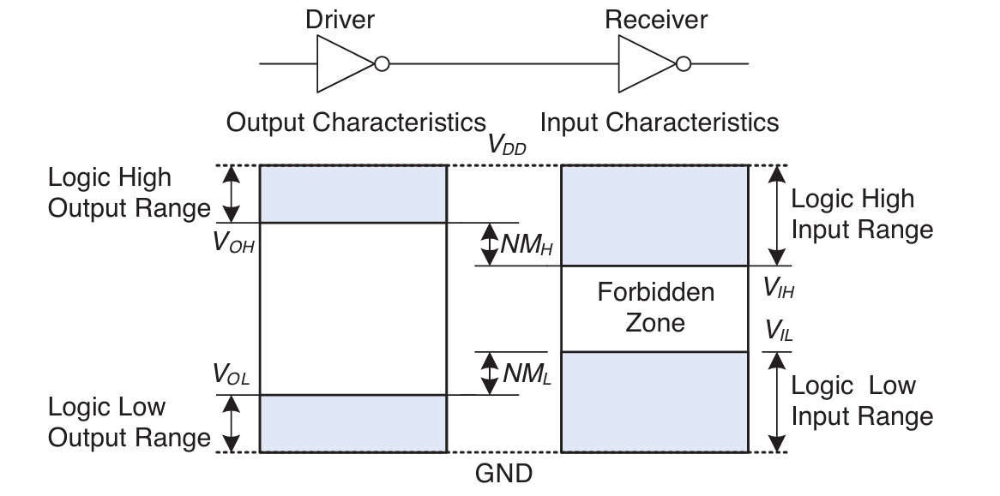
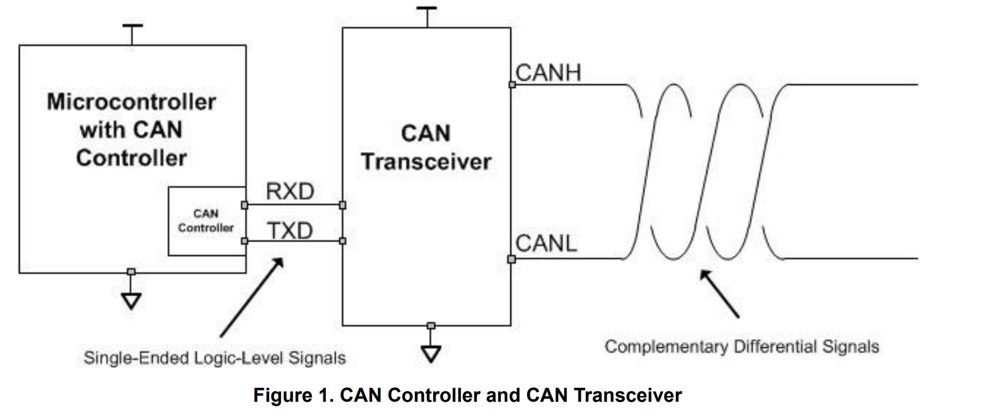

# Intro to Communication in Robotics

> Communication between devices in a robot is important since a robot can be abstracted as a main control board executing the written program for calculations & decision making and sending & receiving messages from motors, sensors, upper machine to control the robot.
>
> We'll talk about the basic knowledge behind communication in robotics and introduce two basic communication protocols in Robomaster robots, which are UART and CAN.

## What is Communication in Robotics

* Bits and Data Representation

  * Bit is the smallest unit a computer can store, it's either 1 or 0

  * 8 bits is a byte

  * Using binary to represent signed numbers, unsigned numbers, float, double, etc.

    

  * ASCII table to convert bits into characters

​														

* Logic level in circuits
  * When the input is in high voltage range, it's a High Level, generally considered as True/1
  * When the input is in low voltage range, it's a Low Level, generally considered as False/0
  * **But sometimes it can be opposite, high voltage can be False/0**
  * Forbidden area exists to filter out signals in undefined region (wire is floating)
  * There will be noises during transfer, so a margin is designed for allowing some noises from receivers' perspective

* Bit rate
  * number of bits transferred in unit time: bit/s (bps)
  * kilobits/s (kbps) megabits/s (Mbps)
* Serial Communication and Parallel Communication
  * Serial Communication
    * one wire between sender and receiver, so all data is sent sequentially, one bit at a time
    * advantage: cheaper than parallel communication, long distance
  * Parallel Communication
    * several wires between sender and receiver, one byte at a time
    * advantage: faster than serial communication, used in scenarios that requires very fast transmission, e.g. internal computer buses
    * disadvantage: expensive, needs many wires, more interference over long distances

* Synchronous and Asynchronous Communication

  * Asynchronous Communication

    * sender sends message to the receiver, but doesn't know when the message arrives at receiver, receiver doesn't know when the message is arriving
    * example: your computer doesn't know when you are going to hit the keyboard and type, but once you type, the typed character is sent to the computer
    * advantage: doesn't need to use clock wire to keep sender and receiver in the same clock
    * disadvantage: slower transmission than synchronous
    * start/stop bit: imagine someone talks to you accidentally, you may miss the first few words, start/stop bit marks the start and end of the message

  * Synchronous Communication

    * sender and receiver have a clock wire connected, no need for start/stop bit
    * better for continuous communication with known frequency

  * More details in https://www.educba.com/synchronous-and-asynchronous-transmission/

    

* Simplex, Half-Duplex, Duplex

  * Simplex
    * Sender cannot receive, one direction communication; cheap, no data collision, simple

  

  * Half-Duplex
    * Only one can send message at a time, walkie-talkie

  

  * Duplex
    * Sender can send and receive simultaneously, dual way communication; less latency comparing to half-duplex, 

  

  * More details: https://www.geeksforgeeks.org/computer-networks/difference-between-simplex-half-duplex-and-full-duplex-transmission-modes/

* Point-to-point, Shared bus 

## UART Communication

* UART (Universal Asynchronous Receiver-Transmitter)
  * Duplex, RX for receive, TX for transmit, **RX-TX, TX-RX, NOT TX-TX RX-RX!**
  * Asynchronous
  * A common data pack
    * start bit: telling receiver the start of communication Low
    * word data: message represented by bits
    * Parity bit: verify the correctness of data, when there are odd numbers of 1 in data, it's 0, when there are even numbers, it's 1
    * Stop bit: stop of communication High
  * Robomaster application
    * communication between VT03 and C board for control message
    * communication between PMM and C board for referee system message
    * wireless communication between C board and laptop for output information for debugging

## CAN Communication

* Terminal Resistor
  * Normally 120Ω at both ends of the CAN wire
  * Reduce signal reflection and makes shifts between 1 and 0 faster
  * Maintains signal quality
  * Zero voltage difference when no signals in can bus

* Differential signal
  * more stable, resistant to noises
* Signal types
  * Voltage difference, Dominant Logic, Low 0
  * Voltage no difference, Recessive Logic, High 1
* 5 Frames, data frame, remote frame, error frame, overload frame, intermission frame
* After 11 recessive logic, CAN bus is idle, can send message onto it

